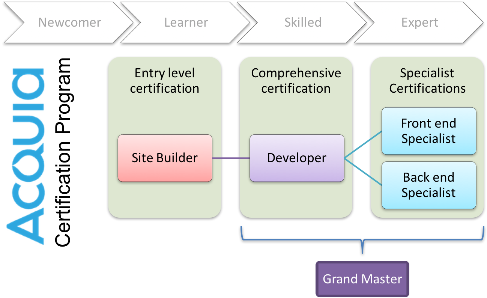

# About the Acquia Certification Program

## What is Acquia Certification?

The [Acquia Certification Program](https://www.acquia.com/customer-success/learning-services/acquia-certification-program-overview) validates skills and knowledge of professionals building solutions with Drupal and on the Acquia Platform. The program is a comprehensive series of examinations and credentials useful to individuals and organizations to demonstrate their expertise with Drupal and the Acquia Platform.

Thousands of developers from around the world have participated in the program since its launch in 2014.

## Why Acquia Certification?

The key benefits of the program for **individuals** are:

* **Validates** your Drupal skills and Knowledge
* Establishes your **Credibility** and expertise with your peers
* Gives you more **Visibility** within the marketplace
* Provides you with a **Formal** certification

The key benefits for **organizations** building Drupal solutions are:

* **Helps you hire** Drupal expertise
* **Differentiates** you in a crowded marketplace of Drupal solution providers
* Provides a **framework for training and certification** of different Drupal team roles

## Which Exams Are Available?

Acquia offers technical Certification in Drupal 7, 8 and 9 in four competencies each:

| Exam | Drupal 9 | Drupal 8 | Drupal 7 |
| :--- | :--- | :--- | :--- |
| Acquia Certified Drupal Site Builder | ✓ | ✓ | ✓ |
| Acquia Certified Drupal Developer | ✓ | ✓ | ✓ |
| Acquia Certified Drupal Front End Specialist | Coming Soon | ✓ | ✓ |
| Acquia Certified Drupal Back End Specialist | Coming Soon | ✓ | ✓ |

## Certification Path

This diagram shows the recommended progression through exam depending on level of Drupal experience. _Applies to both Drupal 7 and 8 series of exams._

## Grand Master Certification

Developers who earn Certified Developer, Certified Front End Specialist, and Certified Back End Specialist \(Drupal 7, Drupal 8 or Drupal 9 series\) _automatically_ earn the **Acquia Certified Grand Master** credential for that version of Drupal. There is _not_ a certification exam to obtain the Grand Master credential.

## Acquia Platform Certification

Acquia provides customers and partners with a valuable platform that enhances the speed, agility, and reliability of delivery of Drupal applications. Acquia Cloud, Acquia Cloud Site Factory, Acquia Content Hub, and Acquia Lift are some components of the Acquia Platform.

Certification Exams for Acquia Platform were launched in 2017.

| Acquia Platform |
| :--- |
| Acquia Cloud Pro |
| Acquia Site Factory Pro |
| Acquia Site Studio Site Builder |
| Acquia Personalization Pro |

> Learn more about the Acquia Certification Program at [https://acquia.com/certification](https://acquia.com/certification)

