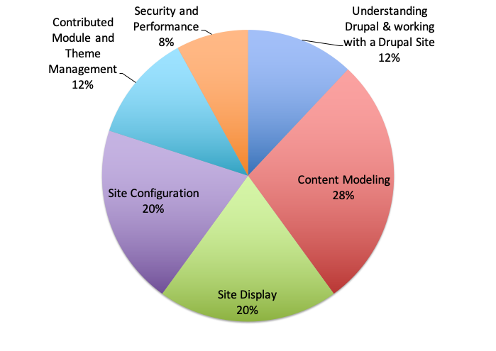

# Exam Domains

| Domain | Number of Questions |
| :--- | ---: |
| 1.0 Understanding Drupal and working with a Drupal Site | 6 |
| 2.0 Content Modeling | 14 |
| 3.0 Site Display | 10 |
| 4.0 Site Configuration | 10 |
| 6.0 Contributed Module and Theme Management | 6 |
| 8.0 Security and Performance | 4 |
| **TOTAL** | **50** |

_**Note:** This exam blueprint includes topics, domains, and test objectives to help guide the test taker. It should not be construed as a comprehensive listing of all of the content of this examination._

> Learn more about the Acquia Certification Program at [https://acquia.com/certification](https://acquia.com/certification)

